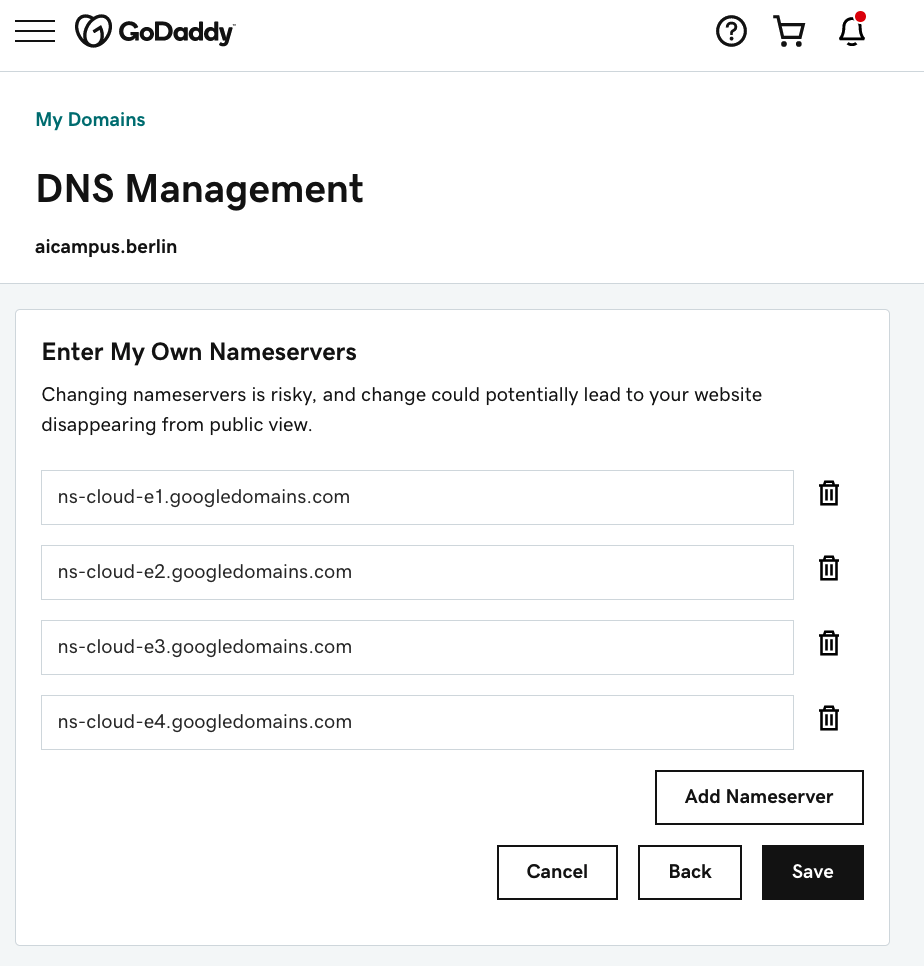

# godaddy-dns-migrator

Package for migrating GoDaddy DNS settings to a Google Cloud Project (GCP) Managed DNS Zone (via Terraform).

### Motivation

I've inherited some GoDaddy managed websites, and found configuration updates on GoDaddy and customer support to be
lacking.  Managing DNS via GCP is a smoother experience with faster DNS updates.

Managing your DNS via [Terraform](https://www.terraform.io/) (infrastructure as code) has two major benefits:
1. Users are forced to explain what DNS changes they're making (via commit messages or Pull Requests).
Without this, it's often hard to reverse engineer why certain DNS records exist.
2. It's easy to roll-back to a previously working DNS states.  This reduces the likelihood of a long-running website 
outage following a DNS change.

### Prerequisites

1. GCP project managed via Terraform (https://cloud.google.com/docs/terraform)
2. GoDaddy API Key (https://developer.godaddy.com/keys)

### Migrating DNS settings

1. Export your DNS settings to a Terraform config file using this package.  (Substitute your own API key, secret, and domain name):
 
    ```bash
    $ GODADDY_API_KEY="your_developer_api_key" \
      GODADDY_API_SECRET="you_developer_api_secret" \
      python3 godaddy_dns_to_gcp_terraform.py --domain yourdomain.com
    ```

2. Move the resulting Terraform config file, `migrated.tf` to your GCP projects Terraform directory (feel free to rename).

3. Run `terraform apply`.  Inspect changes before approving.

4. (Optional) compare the existing DNS responses with GCP managed DNS responses.  For example, you can use [dig](https://linux.die.net/man/1/dig) to compare each entry manually:

    ```bash
    # GoDaddy managed
    dig subdomain.yourdomain.com CNAME

    # GCP managed
    dig @ns-cloud-e1.googledomains.com subdomain.yourdomain.com CNAME
    ```
    You can find the appropriate name server for your GCP Managed DNS zone at https://console.cloud.google.com/net-services/dns/zones

5. In the GoDaddy DNS GUI (https://dcc.godaddy.com/manage/yourdomain.com/dns) change the nameservers from GoDaddy to GCP

    
